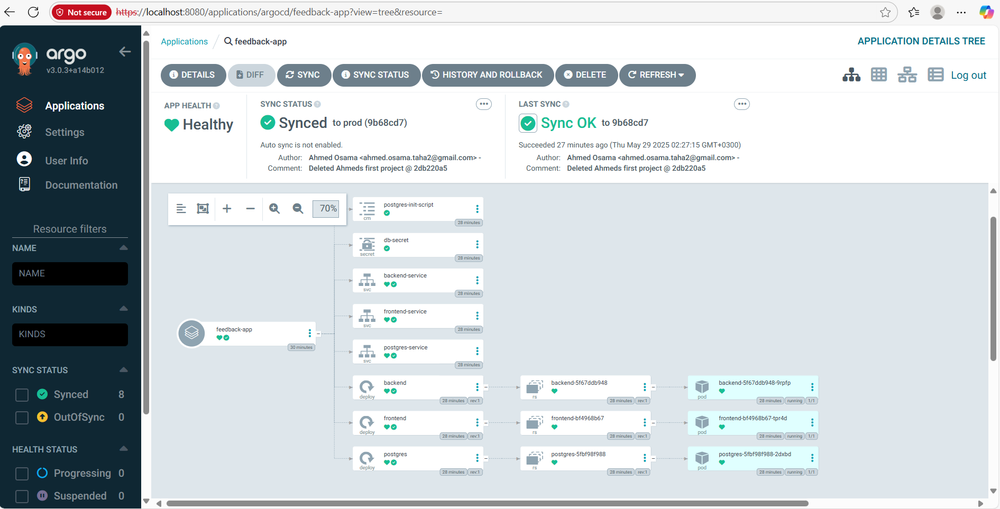
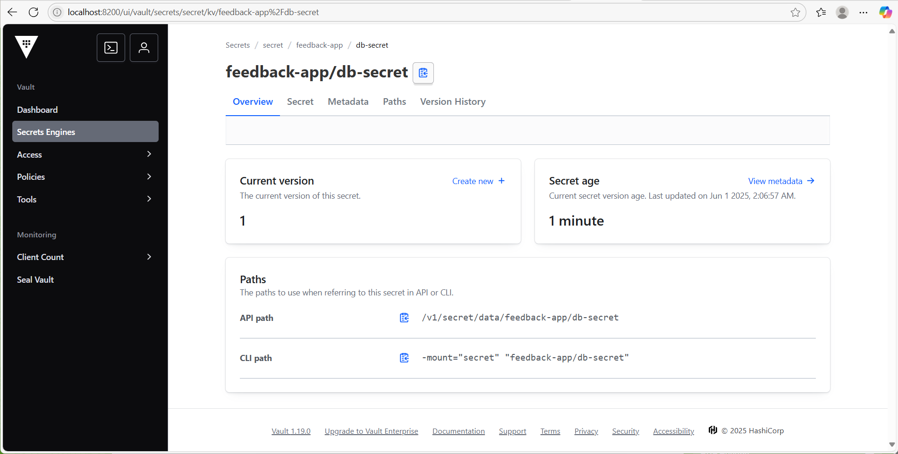
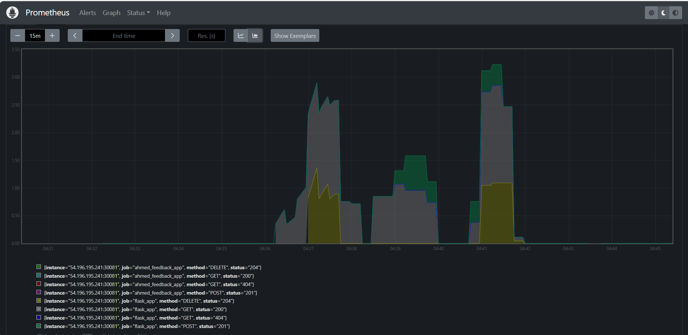
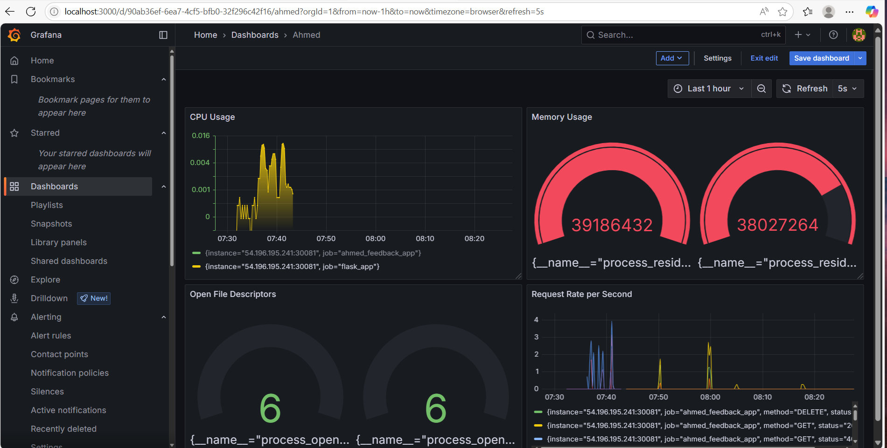
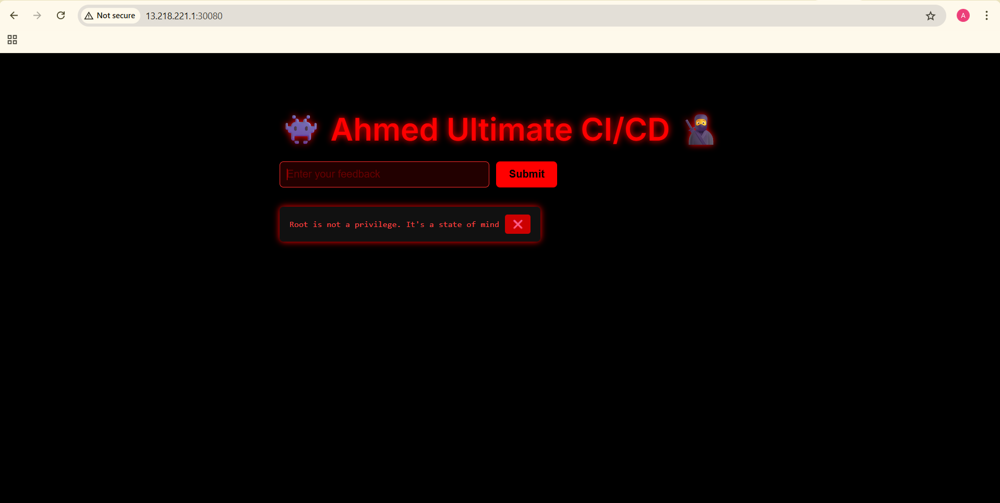

# 🚀 Full CI/CD Pipeline for 3-Tier Feedback App on AWS EKS

This project demonstrates a **production-grade, GitOps-enabled DevOps pipeline** that deploys a 3-tier application (React, Flask, PostgreSQL) to **Amazon EKS**, with automation through **Azure DevOps**, infrastructure-as-code via **Terraform**, secure secrets management with **Vault**, and full observability using **Prometheus & Grafana**.

---

## 🧱 Project Highlights

- 🧩 **Modular IaC**: VPC & EKS Terraform modules ([repo](https://github.com/Ahmed-Osama-Taha/EKS-VPC-Terraform-Modules.git))
- ⚙️ **Agent Bootstrap**: Ansible setup for Azure DevOps self-hosted agent
- 🧪 **CI/CD Pipelines**: Secure build → test → analysis → deploy per environment
- 🚀 **Helm + Argo CD**: GitOps deployment via Helm chart + branch-based Argo CD sync
- 📈 **Observability**: Prometheus metrics + Grafana dashboards
- 🔐 **Secrets**: Dynamic injection using Vault Agent and Kubernetes Auth

---

## 🛠️ Toolchain

| Layer            | Tools Used                                                        |
|------------------|-------------------------------------------------------------------|
| Infrastructure   | Terraform, AWS (VPC, EKS), S3 backend + DynamoDB locking         |
| Configuration    | Ansible                                                           |
| CI/CD            | Azure DevOps, SonarCloud, Docker, Trivy                           |
| Deployment       | kubectl, Helm (JFrog Repo), Argo CD                               |
| Monitoring       | Prometheus, Grafana                                               |
| Secrets          | HashiCorp Vault (K8s Auth + Agent Injector)                      |

---

## 🔁 CI/CD Pipeline Breakdown

### 🧹 Lint + Formatting
- `flake8`, `pylint`, `black`, `isort`

### ✅ Unit Testing
- `pytest` with `coverage.xml` for SonarCloud

### 🧪 Static Analysis
- SonarCloud quality gate → ✅ Passed  


### 🐳 Image Build & Scan
- Docker task (backend & frontend)
- Trivy vulnerability scan

---

## 🌍 Environment-Specific CD Strategy

| Environment | Deployment Method                           | Trigger Type             |
|-------------|----------------------------------------------|--------------------------|
| `dev`       | `kubectl apply -f k8s/*.yaml`                | Parameterized via Azure  |
| `staging`   | Helm chart push (JFrog) → `helm upgrade`     | Parameterized via Azure  |
| `prod`      | GitOps via Argo CD synced with `prod` branch | Automatic                |


---

## 📈 Monitoring & Observability

### 🔍 Prometheus (via Helm)
- Flask backend exposes `/metrics` via `prometheus_flask_exporter`
- Exposed as NodePort: `localhost:30081/metrics`



```python
from prometheus_flask_exporter import PrometheusMetrics
app = Flask(__name__)
metrics = PrometheusMetrics(app)
```

### 📊 Grafana Dashboards
- Dashboards created using PromQL  


---

## 🔐 Vault-Driven Secret Management

- Vault deployed via Helm (dev mode)
- Kubernetes service account + policy binding
- Secret injected into `/vault/secrets/config.txt`

### 🛡️ Vault Policy
```hcl
path "secret/data/feedback-app/db-secret" {
  capabilities = ["read"]
}
```

### 🔐 Pod Annotation Example
```yaml
vault.hashicorp.com/agent-inject: "true"
vault.hashicorp.com/role: "vault-role"
vault.hashicorp.com/agent-inject-token: "true"
vault.hashicorp.com/agent-inject-secret-config.txt: "secret/feedback-app/db-secret"
vault.hashicorp.com/agent-inject-template-config.txt: |
  {{- with secret "secret/feedback-app/db-secret" -}}
  password={{ .Data.data.password }}
  {{- end }}
```



---

## 🧩 Project Structure

```
.
├── terraform/                 # EKS + VPC (modular IaC)
├── ansible/                  # Self-hosted agent setup
├── src/                      # Flask + React + DB
├── helm-chart/               # Helm chart for staging/prod
├── k8s/                      # Raw manifests (dev)
├── k8s-vault/                # Vault-integrated manifests
├── azure-pipelines.yaml      # CI/CD config
└── README.md
```

---
## ✅ Final Result

All components are successfully deployed on EKS and integrated into a secure, observable, and CI/CD-enabled cluster.




---

## 👨‍💻 About Me

**Ahmed Osama Taha** – DevOps Engineer  
📧 ahmed.osama.taha2@gmail.com  
🔗 [LinkedIn](https://www.linkedin.com/in/ahmedosamataha)  
💻 [GitHub](https://github.com/Ahmed-Osama-Taha)

---

If you're hiring or collaborating on cloud-native, scalable pipelines — let's connect!
